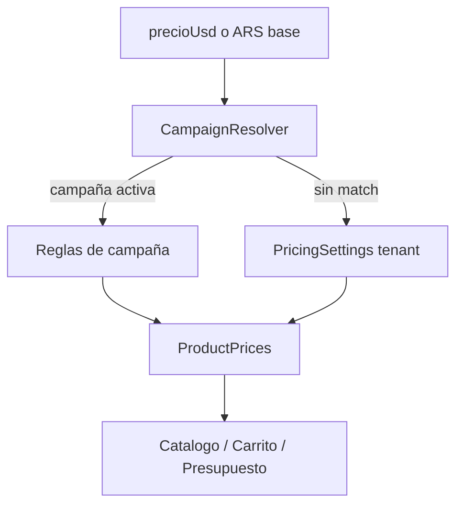

# Campañas y descuentos (ajustado al Excel Urban)

## Hallazgos del Excel (`Catalogo_Armas_Nuevas_Urban_con_Cantidad.xlsx`)

4 hojas:

| Hoja | Rol | ~filas |
|------|-----|--------|
| **Gral** | Stock general multi-marca | ~332 SKU |
| **Taurus** | Misma lógica de precios, solo marca Taurus | ~50 |
| **BERSA** | Listino ARS + promo propia | variantes por código/acabado |
| **Accesorios** | Munición ARS (stock/costo/PVP) — fuera de campañas de armas | ~10 |

### Gral (default Urban, no es “% World Guns”)

Columnas: `SKU`, `Marca`, `Nombre`, `Calibre`, `Descripcion`, `PRECIO DE LISTA`, `Subcategoria`, `Cantidad`, `PRECIO EFECTIVO O TRANSFERENCIA`, `PVP TARJETA`, `3/6/12 CUOTAS DE` (montos ARS).

Parámetros en cabecera: **TC = 1570**, **arancel tarjeta = 1.03**, factores cuota **3→1.0913 / 6→1.1666 / 12→1.3659**.

Fórmula verificada:

- `PVP_tarjeta_USD = efectivo_USD * 1.03`
- `cuota_n_ARS = (efectivo_USD * 1.03 * TC * factor_n) / n`

En la mayoría, efectivo ≈ lista (las armas **no** entran en promos del sitio; texto del Excel lo dice). Ofertas puntuales van en descripción (ej. Sibian 4800→4400) o en el valor de efectivo.

### Taurus

Misma fórmula que Gral; hoja separada por marca (precio USD en col. distinta al layout Gral). Encaja como campaña de **alcance marca** con la misma regla que el default Urban, o simplemente productos en Gral + campaña vacía.

### BERSA (campaña real distinta)

- Precios en **ARS** (`PRECIO SUGERIDO`).
- Efectivo = sugerido × **0.95** (5%).
- **3 cuotas sin interés** = sugerido / 3.
- 6/12 con interés (factores).

### Otros descuentos en texto

- **SARICAM**: “Efectivo o transferencia **10% de descuento**” en descripciones (marca completa en la práctica).

### Implicación

El plan anterior (solo matriz % estilo World Guns) **no alcanza** para Urban. Hace falta:

1. **Pricing general del tenant** (World Guns): sigue siendo % sobre lista USD ([PricingSettingsService](lib/services/pricing_settings_service.dart)).
2. **Campañas** que puedan expresar reglas tipo Urban (arancel + factores + “N sin interés” + % off), y/o % estilo WG para otras armerías.
3. **Import del catálogo Gral** (SKU + precio efectivo/lista + stock + marca) como fuente de verdad de `precioUsd`/stock para Urban — el importer Maiba actual no mapea este layout.

## Comportamiento de producto

- Feature **para todas las armerías**.
- Producto con campaña activa → **reemplaza** Precios y cuotas para ese ítem.
- Sin campaña → pricing general del tenant (World Guns).
- Urban: campaña(s) de marca (BERSA, SARICAM, …) + default Urban para el resto (puede ser campaña `scope=all` o un “modo Urban” en pricing general del tenant).
- Badge en catálogo con nombre de campaña activa.

## Modelo de campaña (concreto)

Migración `041_pricing_campaigns.sql` — tabla `pricing_campaigns`:

- Identidad: `nombre`, `activa`, `prioridad`, `starts_at`/`ends_at` opcionales
- Alcance: `scope` = `all | marca | productos`; `marcas text[]`; `codigos text[]`
- `mode`:
  - `percent_matrix` — igual que Precios y cuotas (efectivo/débito/tarjeta1..18). Uso World Guns / genérico.
  - `urban_formula` — base USD = `precioUsd`; `descuento_efectivo_pct`; `arancel_tarjeta` (ej. 1.03); `factor_3/6/12`; opcional `cuotas_sin_interes` (ej. 3) que fuerza esa cuota = (base_ARS_tras_descuento) / N sin factor.
- RLS/tenant como `productos`.

Ejemplos Urban a cargar en admin (no hardcode eternos):

- **BERSA**: scope marca, `urban_formula`, descuento 5%, `cuotas_sin_interes=3` (precios base ARS del listino → import/convertir a USD con TC o guardar ARS si se decide; **v1: importar sugerido/TC como USD equivalente o columna ARS aparte** — ver abajo).
- **SARICAM**: scope marca, descuento efectivo 10%, resto fórmula Urban.
- **Default Urban** (`scope=all`, prioridad baja): descuento 0%, arancel 1.03, factores del Excel.

**BERSA en ARS:** en v1 convertir `PRECIO SUGERIDO / TC` → `precioUsd` al importar, y calcular cuotas con la misma fórmula; el badge “3 sin interés” viene de la campaña.

## Admin UI

- [admin_home_screen.dart](lib/screens/admin/admin_home_screen.dart): botón **Descuentos y campañas**.
- `AdminCampaignsScreen`: lista activas/inactivas; CRUD con mode + campos según mode; pickers marca/código.
- Mantener **Precios y cuotas** para el default World Guns.

## PricingService

- Resolver campaña → si `percent_matrix`, camino actual con % de la campaña.
- Si `urban_formula`, calcular lista/efectivo/débito/tarjeta/cuotas con TC + arancel + factores / sin interés.
- Devolver `campaignName` para badges.

## Import Urban (follow-up acoplado)

- Parser hoja **Gral**: mapear SKU→codigo, Marca, Nombre, Cantidad→stock, `PRECIO EFECTIVO O TRANSFERENCIA` (o LISTA)→`precioUsd`.
- Hojas Taurus/BERSA: import opcional en la misma pasada o segunda fase.
- Accesorios: fuera de v1 armas.

## Tests

- Fórmula Gral: I→J→K con TC/arancel/factor.
- BERSA: 5% + 3 sin interés.
- Resolución: código > marca > all; sin match → global WG.

## Fuera de alcance v1

- Storefront público.
- Import automático de filas de campaña desde Excel (las campañas se cargan en admin; el Excel guía valores).
- Accesorios/munición como productos de campaña.
